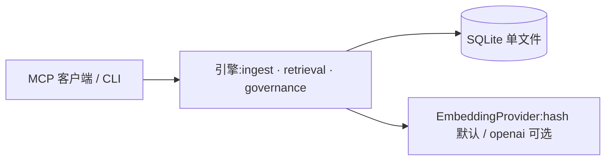

# infimem

**为 AI Agent 提供的"可治理、可评测"长期记忆引擎。** SQLite 单文件部署,MCP 协议接入,检索管线透明可替换,评测数字随代码公开。

> 状态:v0.1(引擎核心 + MCP + CLI + 评测套件)。

```bash
claude mcp add infimem -- npx -y infimem@latest mcp
```

配置一行,之后你只管自然对话:说"记住我用 pnpm",agent 调用 `remember`;下次问"怎么装依赖",它引用记忆回答——每条引用可溯源、可审计、可删除。

## 为什么不是又一个 RAG

当前 Agent 记忆的四个通病,本项目逐一对应:

| 通病 | infimem 的回答 |
|---|---|
| 写入不可控 | 结构化 Schema 强制(类型/作用域/敏感级/置信度),canonical key 去重,冲突隔离不静默覆盖 |
| 检索不稳定 | FTS5 + sqlite-vec 双路召回 → RRF 融合 → rerank 钩子;每条结果带各阶段分数,可回答"为什么召回它" |
| 无治理 | 敏感级检索侧硬过滤、全量写入审计、supersedes 版本链、显式遗忘(tombstone) |
| 无评测 | 30 case 评测集随仓库,Recall@K / MRR / 引用正确率 / 敏感泄漏随版本公开,CI 回归卡合并 |

边界(Non-goals):不做 Agent 框架、不做通用文档 RAG、不自研向量算法、v1 不做云服务。

## 快速开始

**Claude Code / Cursor(MCP 用户)**

```json
{
  "mcpServers": {
    "infimem": {
      "command": "npx",
      "args": ["-y", "infimem@latest", "mcp"],
      "env": { "INFIMEM_DB": "~/.infimem/memory.db" }
    }
  }
}
```

**CLI**

```bash
npx infimem init
npx infimem add "记得周三给房东转房租" --type event --keywords 房租,周三
npx infimem search "房租"          # 带引用与各阶段分数
npx infimem export dump.jsonl     # 导出(JSONL,可重新摄取)
```

数据就是你 `INFIMEM_DB` 指向的那**一个文件**:备份 = 复制;彻底删除 = forget + 删文件。无服务、无 API key(默认离线 embedding)、无 schema 设计负担。

## 架构



- **写入**:`remember` → zod 校验 → 幂等 → 去重 → supersedes/冲突裁决 → memories+FTS+向量同事务提交 → 审计
- **检索**:`search` → BM25 Top-50 ∪ 向量 KNN Top-150 → RRF(k=60) → rerank 钩子 → Top-K 带引用与 trace
- **遗忘**:`forget` → tombstone + 双索引清理 + 审计;`compact` → 报告/索引重建
- 正文是唯一事实源,两个索引都是可重建的派生物(`compact --rebuild-index`)

详见 [ARCHITECTURE.md](./ARCHITECTURE.md)(含完整流程图)、[FEATURES.md](./FEATURES.md)(功能契约)、[USAGE.md](./USAGE.md)(使用者指南)。

## 评测承诺

评测集与代码同仓库,任何人可复现(`npm run eval`);Case 全部为合成数据并注明局限;影响检索/写入的 PR 在 CI 对比上一版数字,绝对退化 >2% 不能合并。

当前基线(provider: hash,30 cases,详见 [EVALUATIONS.md](./EVALUATIONS.md)):

| Metric | Value |
|---|---|
| Recall@1 | 0.811 |
| Recall@5 | 0.900 |
| Recall@10 | 0.900 |
| MRR | 0.900 |
| Citation precision | 1.000 |
| Faithfulness(词面代理) | 0.917 |
| P95 latency | <1 ms |
| Sensitivity leaks | **0** |

诚实声明:默认 hash embedding 语义泛化弱,paraphrase 类 case 目前只有 2/5——治理/时序/作用域/敏感级/冲突类全部满分,泛化能力留给可插拔的 embedding provider(v0.2 本地 ONNX / 设 key 即用 openai)。

## 已知限制(v0.1)

- 单库绑定单一 embedding 维度(建库时确定);跨 provider 迁移需新建库 + import
- FTS5 unicode61 不切分中文,中文子串匹配依赖向量路(见上方 smoke:混合检索真实互补)
- 向量召回无预过滤,超量取回后置过滤,百万级以下够用
- 导入是"重新摄取"而非字节级恢复(备份 = 复制 .db 文件)

## 本地开发

```bash
npm ci && npm run build && npm test   # 类型检查、构建、83 个测试
git config core.hooksPath .githooks   # 启用 pre-push 敏感信息门禁(克隆后执行一次)
npm run audit                         # 手动全量审计:扫描全部历史中的秘密/个人信息
```

pre-push 钩子会扫描待推送提交的文件名与内容(密钥/token/私钥块/本机路径等),命中即拒绝推送。

## License

MIT
